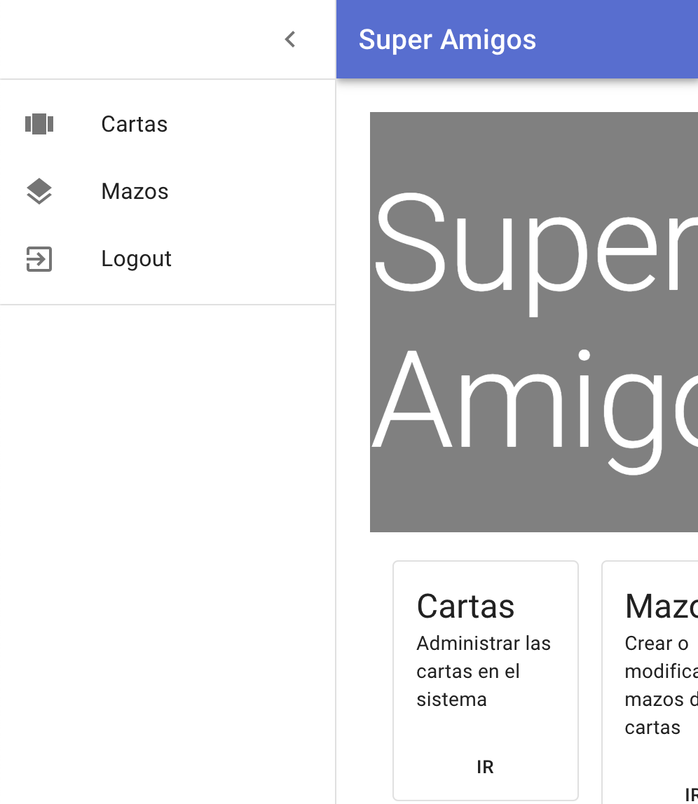
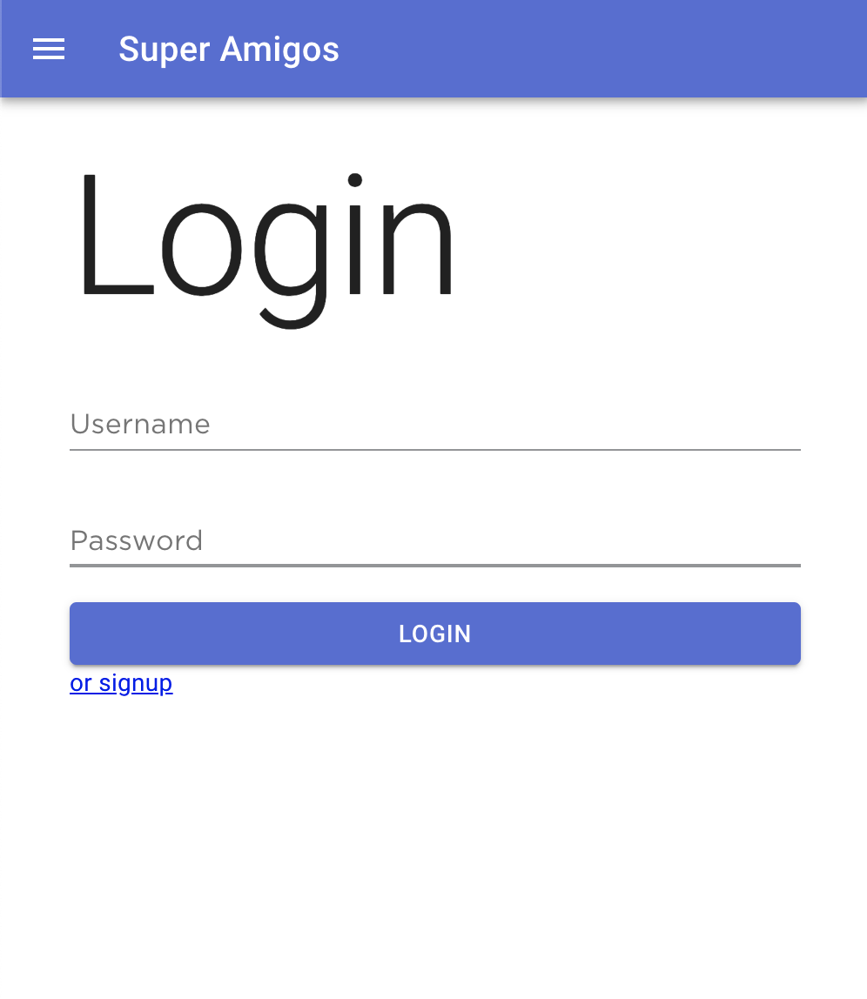
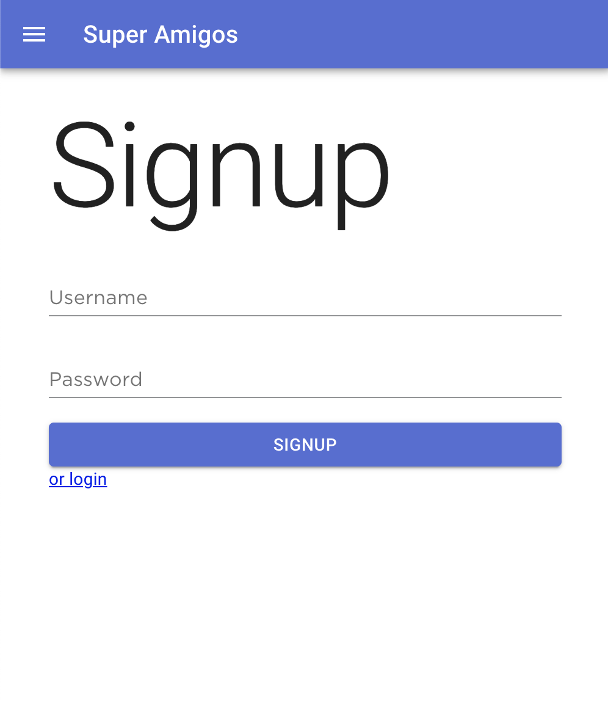
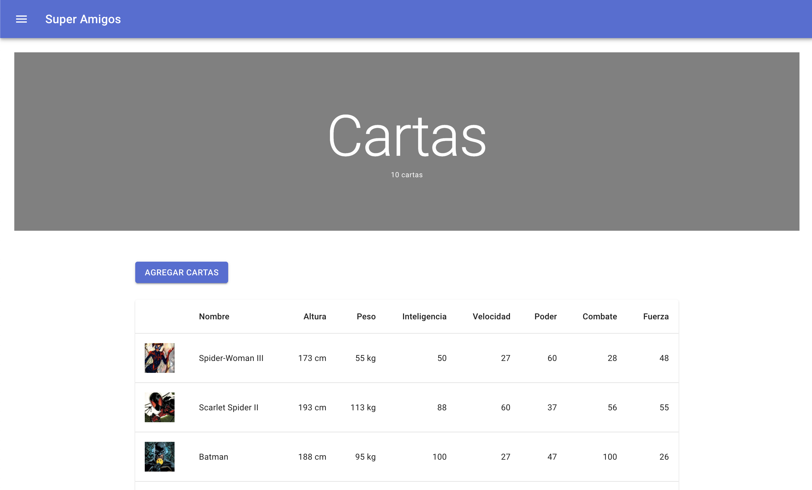
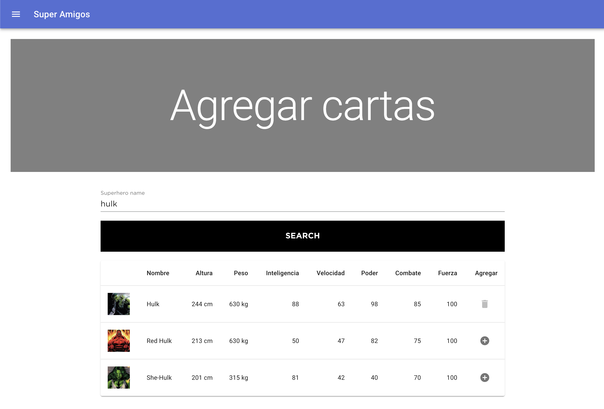
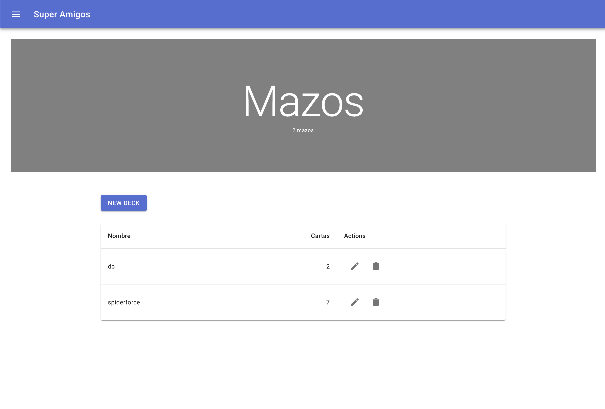
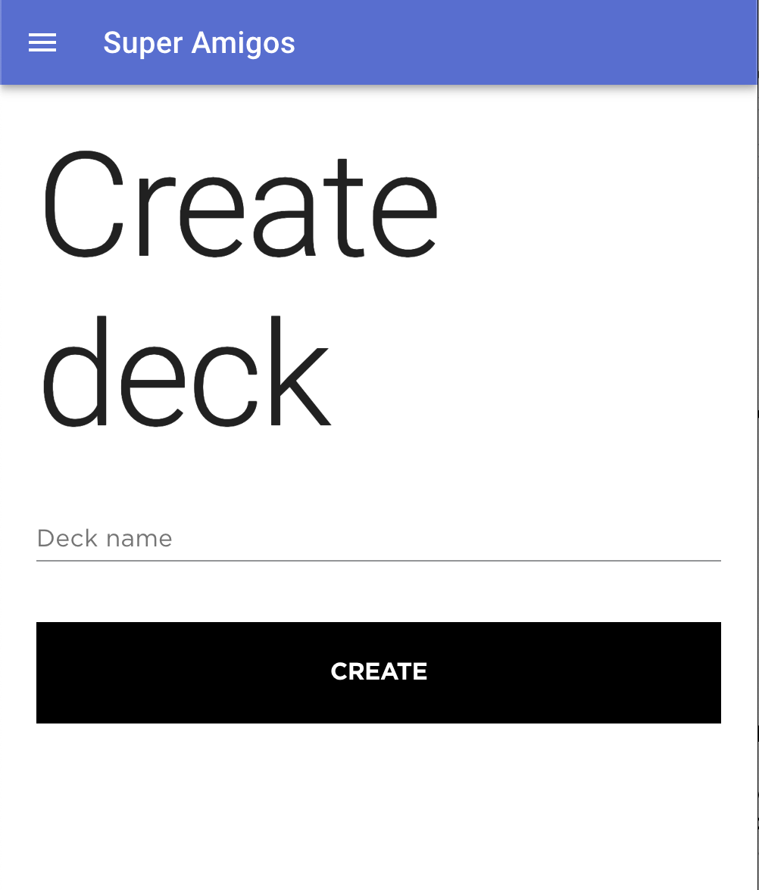

# frontend

# Drawer

Existe un drawer a la izquierda que permite acceder a algunas opciones del sistema

# Login y Signup

Se puede hacer login y registrarse en las siguientes rutas

`/auth/login`

`/auth/signup` (solo para admin por ahora)

# Cartas

Se pueden ver todas las cartas en el sistema (sin necesidad de estar logueado) en `/cards`

Se pueden agregar cartas (siendo admin logueado) en `/cards/add`

# Mazos

Se pueden ver todos los mazos en el sistema (sin necesidad de estar logueado) en `/decks` (al hacer click en editar se pueden agregar cartas a un mazo)

Se pueden crear mazos (siendo admin logueado) en `/decks/create`

